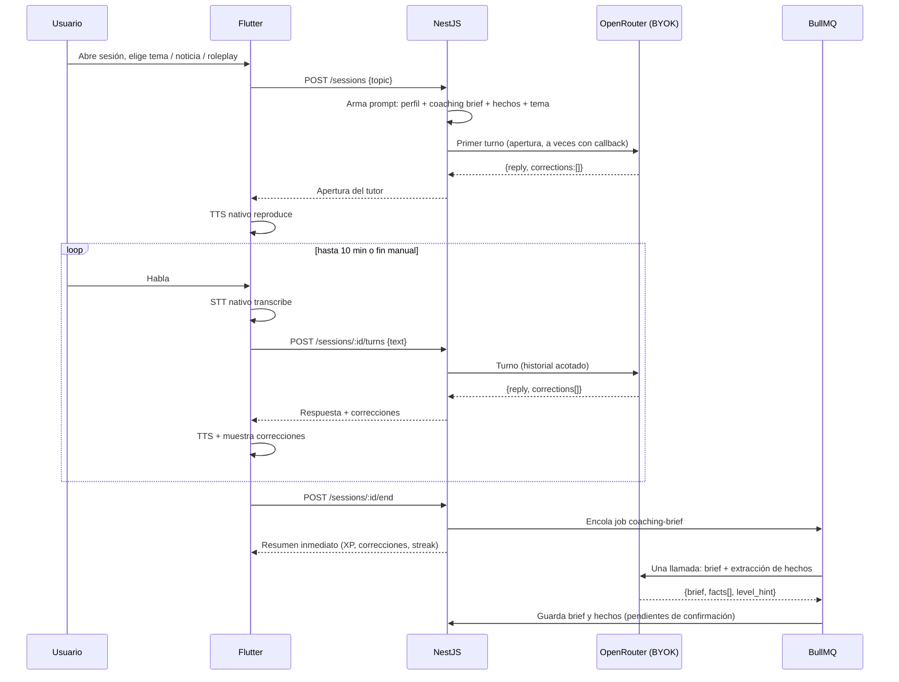
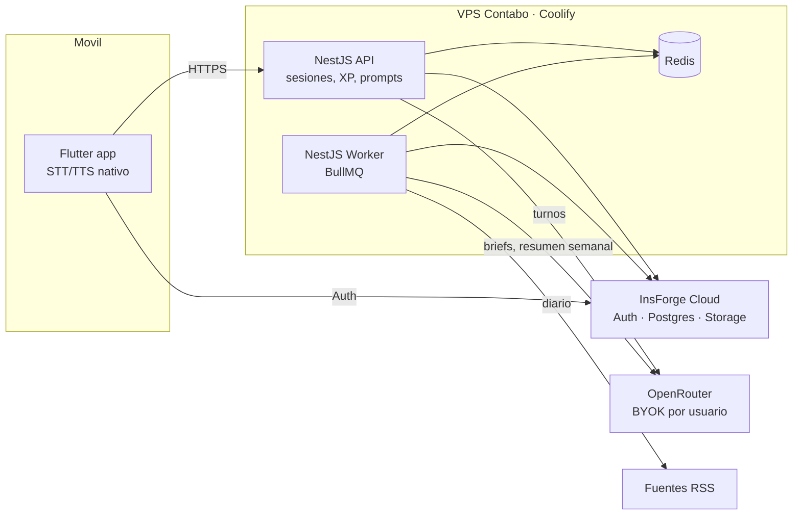
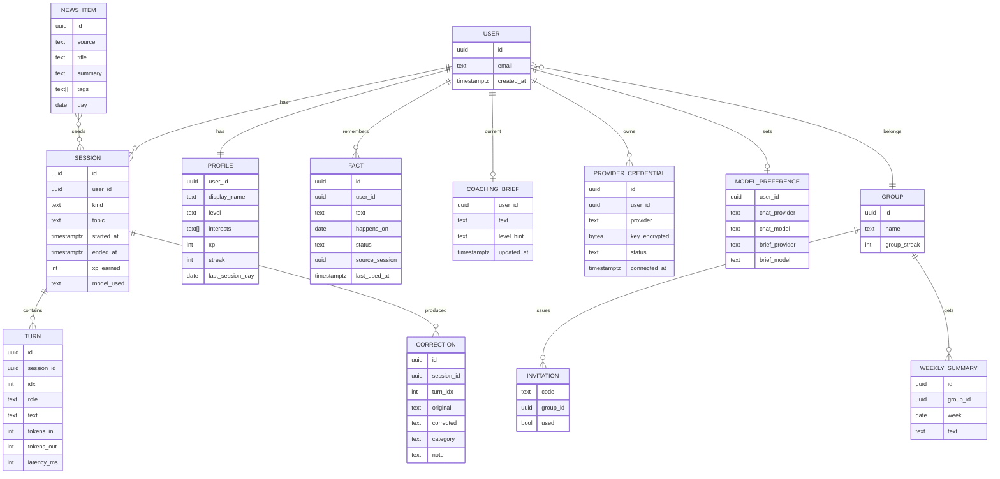

# Fluent — PRD (Product Requirements Document)

| Campo | Valor |
|---|---|
| Versión | 1.1 |
| Fecha | 2026-09-08 |
| Fuente | `docs/PROYECTO.md` (brief) |
| Estado | Aprobado el 2026-09-08 |

---

## 1. Resumen

Fluent es una app móvil de práctica de inglés conversacional por voz, con un tutor de IA que recuerda al usuario y ajusta cada sesión. Está pensada para un grupo cerrado de 5 a 10 amigos, con sesiones de 10 minutos dos veces al día, gamificación y un fuerte componente social.

El proyecto tiene doble propósito: mejorar el inglés del grupo de forma medible, y servir como ejercicio documentado de arquitectura (BaaS + servicio de dominio + jobs asíncronos).

**Principio rector:** gastar lo mínimo posible en LLM. Toda decisión de producto y arquitectura se subordina a esto.

---

## 2. Objetivos y no objetivos

### Objetivos v1
- O1. Que cada usuario complete al menos una sesión de voz de 10 minutos al día, de forma sostenida.
- O2. Que el tutor demuestre memoria entre sesiones (callback de hechos personales y coaching brief) sin fine-tuning ni RAG.
- O3. Costo marginal de LLM para el operador: **0 USD** (BYOK con modelos gratuitos de OpenRouter).
- O4. Que el grupo interactúe: leaderboard semanal, resumen compartible, desafíos cruzados.
- O5. Que la arquitectura quede documentada como material de estudio (ADRs, diagramas, decisiones).

### No objetivos v1
- Monetización, tier premium, Stripe.
- Fine-tuning de modelos. Descartado definitivamente.
- RAG, embeddings, pgvector.
- Multiagente (conversador + evaluador separados).
- Push notifications con Firebase.
- Personalidades múltiples del tutor.
- Uso público o registro abierto.

---

## 3. Usuarios

| Persona | Descripción | Necesidad principal |
|---|---|---|
| Miembro del grupo | Adulto hispanohablante, nivel A2 a B2, quiere hablar inglés con más soltura. Tiene 10 minutos libres, no una hora. | Práctica corta, sin fricción, que note progreso. |
| Operador | El autor del proyecto. Administra el VPS, invita al grupo. | Cero costo de LLM, operación sencilla, código que valga la pena estudiar. |

Niveles: se soportan varios niveles desde el día uno. En el onboarding el usuario elige su nivel percibido (A2, B1, B2) y el tutor lo ajusta con el coaching brief a partir de la tercera sesión.

---

## 4. Principios de diseño

1. **Una llamada por turno.** El modelo responde y corrige en la misma llamada, con salida JSON estructurada.
2. **Una llamada extra por sesión, no por turno**, para el coaching brief, ejecutada en background.
3. **Contexto pequeño y estructurado.** El "conocimiento" del usuario cabe entero en el prompt.
4. **Gratis por defecto, pago por elección del usuario.** El operador nunca paga LLM. Cada usuario usa modelos gratuitos salvo que elija uno pago con su propia cuenta. Debajo de cualquier elección hay una cadena de fallback gratuita.
5. **Voz en el dispositivo.** STT y TTS con las APIs nativas del sistema operativo, sin servicios externos de audio.
6. **Magia dosificada.** El callback de memoria no aparece en todas las aperturas.
7. **El usuario ve y edita lo que el tutor recuerda.** Transparencia y corrección de alucinaciones.
8. **Documentar mientras se construye.** Cada decisión de arquitectura genera un ADR.

---

## 5. Experiencia principal: una sesión



Duración objetivo por sesión: 10 minutos. La app avisa a los 8 y cierra suave a los 10. El usuario puede terminar antes.

---

## 6. Requisitos funcionales

Prioridad: **P0** imprescindible para v1, **P1** deseable en v1, **P2** después.

### 6.1 Cuentas y acceso
| ID | Requisito | Prioridad |
|---|---|---|
| RF-1.1 | Registro solo por invitación. El operador genera códigos de invitación de un solo uso. | P0 |
| RF-1.2 | Auth con InsForge (email + contraseña; OAuth social como P2). | P0 |
| RF-1.3 | Perfil: nombre visible, nivel declarado (A2/B1/B2), intereses iniciales (3 a 5 tags). | P0 |
| RF-1.4 | Pertenencia a un único grupo en v1. | P0 |

### 6.2 Proveedores y modelos (BYOK)
| ID | Requisito | Prioridad |
|---|---|---|
| RF-2.1 | Conexión de cuenta OpenRouter vía OAuth PKCE desde la app (flujo validado en el POC). Es el proveedor por defecto. | P0 |
| RF-2.2 | Las credenciales de cada proveedor se guardan cifradas en el backend y nunca se exponen a la app después de la conexión. | P0 |
| RF-2.3 | Pantalla de estado por proveedor: conectado, revocado, con error. Reconexión en un toque. Para OpenRouter se muestra el crédito restante de la key. | P0 |
| RF-2.4 | Cadena de fallback de modelos gratuitos configurable por el operador, en orden de preferencia. Se aplica siempre debajo del modelo elegido por el usuario. | P0 |
| RF-2.5 | Si ningún modelo responde, la sesión se degrada a un mensaje claro, sin consumir intentos ni romper el streak. | P0 |
| RF-2.6 | Selector de modelo por usuario. El catálogo se obtiene del endpoint de modelos de OpenRouter y se agrupa en Gratis, Económico y Premium, con precio por millón de tokens y costo estimado por sesión calculado con el promedio real de tokens del usuario. | P0 |
| RF-2.7 | Dos roles de modelo configurables por separado: conversación (prioriza latencia) y coaching brief (prioriza calidad, corre async). Por defecto ambos usan el gratuito. | P1 |
| RF-2.8 | Segundo proveedor desde v1: Google Gemini mediante API key de Google AI Studio pegada por el usuario, usando el endpoint compatible con OpenAI. Mismo adaptador que OpenRouter con otra URL base. El onboarding lo presenta como opción recomendada por calidad y estabilidad del free tier frente a los modelos gratuitos de OpenRouter. | P0 |
| RF-2.9 | Si el modelo pago falla por crédito agotado o cuota, se cae a la cadena gratuita y se avisa al usuario en la sesión y en la pantalla de proveedores. | P0 |

Nota sobre Google: una suscripción a Google AI Pro da acceso a la app de Gemini, no a la API. El free tier de la API existe para cualquier cuenta en Google AI Studio, con límites por minuto y por día que alcanzan para dos sesiones diarias. Cargar la key de Gemini dentro de OpenRouter es posible, pero añade comisión y un salto; no se hace en v1.

### 6.3 Conversación por voz
| ID | Requisito | Prioridad |
|---|---|---|
| RF-3.1 | STT nativo (Android SpeechRecognizer, iOS Speech). El usuario ve la transcripción antes de enviar y puede corregirla. | P0 |
| RF-3.2 | TTS nativo para las respuestas del tutor, con control de velocidad. | P0 |
| RF-3.3 | Modo texto como alternativa cuando no hay micrófono o en lugares ruidosos. | P1 |
| RF-3.4 | Cada turno devuelve `{reply, corrections[]}`; las correcciones se muestran de forma no intrusiva (chip expandible). | P0 |
| RF-3.5 | Historial de conversación enviado al modelo acotado a los últimos N turnos (N configurable, inicial 8). | P0 |
| RF-3.6 | Temporizador visible, aviso a los 8 minutos, cierre suave a los 10. | P0 |
| RF-3.7 | Tipos de sesión: tema libre elegido, roleplay generado, opinión sobre noticia. | P0 |
| RF-3.8 | Streaming de la respuesta del tutor para reducir latencia percibida. | P1 |

### 6.4 Memoria y coaching
| ID | Requisito | Prioridad |
|---|---|---|
| RF-4.1 | Al cerrar la sesión se encola un job que, en una sola llamada, produce el coaching brief y extrae hechos personales con fecha si aplica. | P0 |
| RF-4.2 | Los hechos extraídos quedan en estado "pendiente" hasta que el usuario los confirme o los descarte en la pantalla "Lo que recuerdo de vos". | P0 |
| RF-4.3 | Solo los hechos confirmados se inyectan en prompts futuros. | P0 |
| RF-4.4 | El callback de apertura usa un hecho confirmado con probabilidad configurable (inicial 40 %), y nunca el mismo dos sesiones seguidas. | P0 |
| RF-4.5 | El coaching brief se limita a un tamaño fijo (inicial 600 caracteres) y reemplaza al anterior, incorporándolo como entrada. | P0 |
| RF-4.6 | El usuario puede borrar hechos, editar el brief o resetear toda su memoria. | P0 |
| RF-4.7 | Errores recurrentes se registran de forma estructurada (categoría gramatical, ejemplo) para mostrar tendencia. | P1 |

### 6.5 Gamificación
| ID | Requisito | Prioridad |
|---|---|---|
| RF-5.1 | XP por sesión completada, con bonus por duración y por sesión doble en el día. | P0 |
| RF-5.2 | Streak individual diario. Un "día de gracia" a la semana para no perderla. | P0 |
| RF-5.3 | Boss battle: cada N sesiones (inicial 7), el tutor propone un tema fuera de la zona de confort con XP doble. | P1 |
| RF-5.4 | Niveles de XP con nombre, sin efecto funcional. | P1 |

### 6.6 Social
| ID | Requisito | Prioridad |
|---|---|---|
| RF-6.1 | Leaderboard semanal del grupo por XP, con reinicio los lunes. | P0 |
| RF-6.2 | Streak grupal: cuenta los días en que todos los miembros activos completaron al menos una sesión. | P1 |
| RF-6.3 | Resumen semanal en texto generado por LLM, formateado para pegar en WhatsApp, con botón de compartir. Una llamada por grupo por semana. | P1 |
| RF-6.4 | Desafío cruzado: "X practicó sobre Y, ¿te animás?" a partir de los temas de la semana, sin llamada al LLM. | P1 |
| RF-6.5 | Visibilidad: los miembros ven XP, streak y temas de los demás. Nunca transcripciones ni hechos personales. | P0 |

### 6.7 Contenido
| ID | Requisito | Prioridad |
|---|---|---|
| RF-7.1 | Job diario que lee fuentes RSS configuradas y guarda titulares y resúmenes. | P0 |
| RF-7.2 | Las noticias se filtran por intereses del usuario y se presentan como disparador de opinión. La pregunta la genera el tutor dentro del primer turno, sin llamada extra. | P0 |
| RF-7.3 | Roleplays generados dentro del primer turno a partir de un escenario semilla (lista curada de 30 escenarios). | P0 |
| RF-7.4 | Catálogo de temas libres sugeridos según intereses. | P0 |

### 6.8 Administración
| ID | Requisito | Prioridad |
|---|---|---|
| RF-8.1 | Panel mínimo del operador: usuarios, invitaciones, estado de jobs, modelos activos. Puede ser CLI o página simple. | P1 |
| RF-8.2 | Métricas de uso agregadas: sesiones por día, duración media, tasa de fallo del LLM. | P1 |

---

## 7. Requisitos no funcionales

| Área | Requisito |
|---|---|
| Costo | 0 USD de LLM por parte del operador. Máximo 1 llamada por turno y 1 por sesión, más 1 semanal por grupo. |
| Latencia | Primer token del tutor en menos de 3 s en el 90 % de los turnos con modelo gratuito sano. |
| Disponibilidad | Best effort. Sin SLA. Si OpenRouter falla, mensaje claro y la sesión no cuenta como fallida para el streak. |
| Privacidad | Transcripciones y hechos solo visibles para su dueño. API keys cifradas en reposo. Borrado de cuenta completo bajo pedido. |
| Seguridad | Solo invitación. Rate limit por usuario en la API. Secretos fuera del repo. |
| Portabilidad | API y worker en Docker vía Coolify. InsForge en su nube gestionada, con backups exportables y software open source idéntico para autoalojar si hiciera falta. |
| Observabilidad | Logs estructurados en NestJS, métricas de jobs en BullMQ, registro de cada llamada al LLM con modelo, tokens y latencia. |
| Documentación | Un ADR por decisión de arquitectura en `docs/adr/`. Diagramas en el repo. |

---

## 8. Arquitectura



Nota: el brief original menciona Hetzner. La infraestructura real es el VPS de Contabo donde ya corre Coolify. Los proyectos existentes en ese VPS ya usan NestJS y Coolify, así que no se añade ninguna pieza nueva de operación.

### 8.1 Responsabilidades
- **Flutter:** UI, captura y reproducción de voz, auth con InsForge, llamadas a la API.
- **NestJS API:** construcción de prompts, adaptador de LLM compatible con OpenAI (OpenRouter, Gemini) con las credenciales del usuario, selección de modelo por rol y fallback, reglas de XP y streaks, endpoints de sesión.
- **NestJS Worker:** jobs de coaching brief, noticias diarias, resumen semanal, recordatorios.
- **InsForge Cloud:** identidad, Postgres y storage. Sin lógica de negocio. Gestionado; mismo software open source si algún día se autoaloja (ADR 0001).
- **Redis:** cola BullMQ y caché corta de prompts y noticias.

### 8.2 Modelo de datos (borrador)



### 8.3 Contratos con el LLM

**Turno de conversación.** Entrada: system prompt con rol, nivel, brief, hechos confirmados elegidos, tema o escenario, reglas de corrección; historial de los últimos N turnos; mensaje del usuario. Salida obligatoria:

```json
{
  "reply": "texto del tutor en inglés",
  "corrections": [
    { "original": "I go yesterday", "corrected": "I went yesterday", "category": "past_simple", "note": "breve, en español" }
  ]
}
```

**Cierre de sesión (async).** Entrada: transcript completo de la sesión, brief anterior, hechos ya conocidos. Salida:

```json
{
  "brief": "máx. 600 caracteres, en inglés, orientado a instrucciones para el tutor",
  "facts": [ { "text": "tiene entrevista de trabajo", "happens_on": "2026-09-12" } ],
  "level_hint": "B1",
  "recurring_errors": [ { "category": "present_perfect", "example": "..." } ]
}
```

**Resumen semanal (async, por grupo).** Entrada: stats de la semana por miembro y temas. Salida: texto en español listo para WhatsApp.

Toda salida se valida contra un esquema. Si el modelo no cumple el JSON, se reintenta una vez con el siguiente modelo de la lista y luego se degrada (respuesta sin correcciones, o job marcado como fallido para reintento).

---

## 9. Riesgos y mitigaciones

| Riesgo | Impacto | Mitigación |
|---|---|---|
| Modelos gratuitos alucinan hechos en la extracción | Memoria falsa, pérdida de confianza | Hechos en estado pendiente hasta confirmación. Pantalla editable. |
| Modelos gratuitos no respetan JSON | Turnos rotos | Validación de esquema, reintento con fallback, degradación controlada. |
| OpenRouter caído o con rate limit en gratuitos | Sesiones fallan | Lista de fallback, mensaje claro, no penaliza streak. |
| Calidad del STT nativo con acento hispano | Frustración | El usuario ve y corrige la transcripción antes de enviar. Modo texto. |
| InsForge Compute en private preview | Ninguno en v1 | Toda la lógica vive en NestJS. |
| Abandono del grupo a las pocas semanas | El proyecto pierde su parte de idioma | Social desde v1, sesiones cortas, callback de memoria. Medir retención semanal. |
| Ruta IPv4 del VPS a GitHub inestable | Deploys lentos | Ya mitigado con timeouts y reintentos. Coolify hace build en el propio VPS. |

---

## 10. Métricas de éxito

| Métrica | Objetivo a 8 semanas |
|---|---|
| Miembros activos semanales | 70 % del grupo |
| Sesiones por usuario por semana | ≥ 8 |
| Duración media de sesión | ≥ 7 min |
| Hechos confirmados por usuario | ≥ 5 |
| Tasa de turnos fallidos por LLM | < 5 % |
| Costo de LLM del operador | 0 USD |
| ADRs escritos | ≥ 8 |

---

## 11. Plan por fases

| Fase | Alcance | Resultado |
|---|---|---|
| 0. Fundaciones | Monorepo, proyecto en InsForge Cloud, NestJS API y worker desplegados, Flutter con auth. ADRs 1 a 4. | Login funcional en el móvil contra el VPS. |
| 1. Conversación | BYOK PKCE, turno con JSON, STT/TTS nativo, temporizador, temas libres. | Primera sesión real de 10 minutos. |
| 2. Memoria | Job de cierre, brief, hechos pendientes, pantalla "Lo que recuerdo", callback dosificado. | El tutor recuerda entre sesiones. |
| 3. Juego y grupo | XP, streaks, invitaciones, leaderboard semanal, visibilidad de temas. | El grupo entra y compite. |
| 4. Contenido | RSS diario, noticias como disparador, roleplays semilla, boss battles. | Variedad sin costo extra. |
| 5. Social generativo | Resumen semanal para WhatsApp, desafíos cruzados, streak grupal. | Motivación externa a la app. |
| 6. Pulido | Streaming, modo texto, panel del operador, métricas. | Listo para uso diario estable. |

Cada fase termina con una demo usable y sus ADRs.

---

## 12. Preguntas abiertas

1. ¿Lista inicial de modelos gratuitos de OpenRouter y criterio de orden? Propuesta: medir JSON válido y latencia con 20 turnos de prueba antes de fijarla.
2. ¿El grupo comparte un solo idioma de interfaz (español) o hace falta inglés para la UI?
3. ¿Se guarda el audio o solo la transcripción? Propuesta: solo texto en v1, por privacidad y storage.
4. ¿Recordatorios sin push? Propuesta: notificación local programada desde la app, sin backend.
5. ¿Nombre definitivo? Se usa "Fluent" como nombre de trabajo.
6. ¿Se abre en v1 un proveedor genérico "compatible con OpenAI" para cualquier URL y key, o solo OpenRouter y Gemini? Propuesta: solo los dos en v1; el genérico es trivial de añadir después.

---

## 13. Aprobación

| Rol | Nombre | Estado |
|---|---|---|
| Dueño del producto | Alejandro | Aprobado 2026-09-08 |
| Arquitectura | Claude | Aprobado 2026-09-08 |
