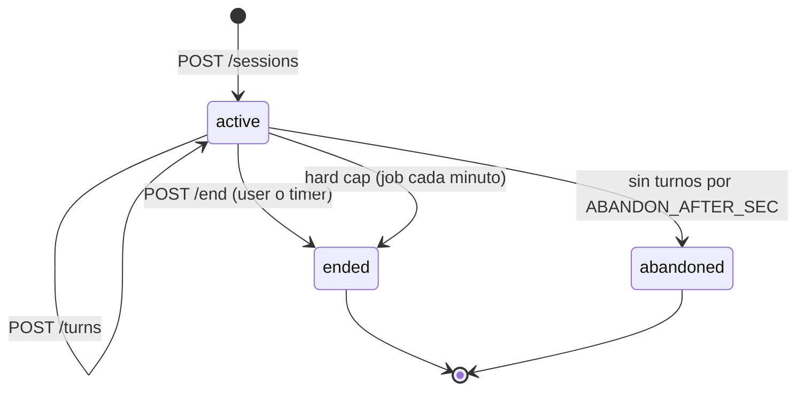

# SPEC-04 — Sesión de conversación

Estado: borrador v0.1 · Cubre: RF-3.1 a RF-3.8, RF-4.4, RF-5.3, RF-7.2 a RF-7.4 · SPEC-02 §4.3, SPEC-03

## 1. Constantes (en `config/product.ts`)

| Nombre | Valor | Uso |
|---|---|---|
| SESSION_TARGET_SEC | 600 | duración objetivo |
| SESSION_WARN_SEC | 480 | aviso en la app |
| SESSION_HARD_CAP_SEC | 720 | la API cierra sola si sigue abierta |
| MIN_SESSION_SEC | 180 | mínimo para que cuente para XP y streak |
| MIN_TURNS_FOR_BRIEF | 3 | turnos del usuario para encolar el brief |
| ABANDON_AFTER_SEC | 1800 | sesión activa sin turnos → `abandoned` |
| CALLBACK_PROBABILITY | 0.4 | RF-4.4 |
| BOSS_EVERY_N_SESSIONS | 7 | RF-5.3 |

## 2. Estados

Solo puede haber **una sesión `active` por usuario**. `POST /sessions` con una activa devuelve `409 SESSION_ALREADY_ACTIVE` con `activeSessionId`; la app ofrece retomarla o cerrarla.

## 3. Apertura (`POST /sessions`)

1. Verificar perfil onboarded y credencial activa para el proveedor del rol `chat` (o cualquiera si usa fallback). Si no: `PROVIDER_NOT_CONNECTED`.
2. Resolver `kind`:
   - Si `profile.sessions_count + 1` es múltiplo de `BOSS_EVERY_N_SESSIONS` y el usuario no ha rechazado el boss hoy, `GET /suggestions` ya devolvió `bossPending: true`; el cliente manda `kind:'boss'`. Si manda otro kind, se respeta (el boss se ofrece, no se impone) y `bossPending` sigue true en la próxima.
   - `free_topic` requiere `topic` (2 a 80 caracteres). `roleplay` requiere `roleplayId`. `news` requiere `newsItemId` de los últimos 14 días. `boss` toma un tema de la lista `BOSS_TOPICS` filtrando los ya usados por el usuario.
3. Callback: con probabilidad `CALLBACK_PROBABILITY` y si la sesión anterior no usó callback, llamar `pick_callback_fact`. Si devuelve hecho, se guarda en `sessions.callback_fact_id`.
4. Construir prompt (SPEC-03 §4.1 con `opening_rule`) e invocar `LlmClient` con `messages = [system, {role:'user', content:'(The learner just joined. Start the session.)'}]`.
5. Persistir `sessions` y `turns[idx=0, role=tutor]`. Responder `{ session, opening: { text, callbackUsed } }`.

Si el LLM falla en la apertura, se responde degradado con un saludo fijo por `kind` y la sesión sigue activa.

## 4. Turno (`POST /sessions/:id/turns`)

1. Validar sesión activa del usuario, longitud del texto y ritmo (SPEC-02 §7).
2. Insertar `turns[role=user]` con `idx = último + 1`.
3. Cargar historial: últimos `HISTORY_TURNS` turnos.
4. Invocar `LlmClient` con schema `TurnOutput`.
5. Insertar `turns[role=tutor]` con modelo, tokens, latencia; insertar `corrections` con `turn_idx` del usuario.
6. Actualizar `sessions.turns_count`, `chat_model_used`.
7. Responder `{ turnIdx, reply, corrections, modelUsed, degraded }`.

Concurrencia: lock en Redis `session:<id>:turn` (5 s). Segundo turno simultáneo → `409 SESSION_NOT_ACTIVE` con mensaje "espera la respuesta anterior".

### Streaming (RF-3.8, P1)
`POST /sessions/:id/turns/stream` hace lo mismo pero con `stream: true` al proveedor y reenvía tokens por SSE. Como la salida es JSON, la API acumula, detecta el valor de `reply` con un parser incremental y emite `token` solo para ese campo; al terminar emite `corrections` y `done`. Si el parser falla, cae al modo no streaming de forma transparente para la app.

## 5. Cierre (`POST /sessions/:id/end`)

1. `duration_sec = now - started_at`, acotado a `SESSION_HARD_CAP_SEC`.
2. RPC `close_session(id, duration_sec, turns_count)` aplica SPEC-07 y devuelve el resumen de XP y streak. Si `duration_sec < MIN_SESSION_SEC` o `turns_count < 2`, la sesión se marca `ended` con `xp_earned = 0` y no toca el streak.
3. Si `turns_count ≥ MIN_TURNS_FOR_BRIEF`, encolar job `coaching-brief` (SPEC-05) y poner `brief_job_status='pending'`; si no, `done` sin job.
4. Responder `summary`.

## 6. Mantenimiento

Job `session-sweeper` cada minuto (SPEC-05): cierra por hard cap y marca `abandoned`. Las abandonadas con ≥ `MIN_SESSION_SEC` y ≥ 2 turnos se cierran como `ended` con XP, para no castigar un cierre de app.

## 7. Sugerencias (`GET /sessions/suggestions`)

- `topics`: 6 temas del catálogo `TOPICS` (60 entradas con tags) que casen con `interests`, más 2 aleatorios fuera de intereses.
- `roleplays`: 4 escenarios con `level_min ≤ level`, evitando los 5 últimos usados.
- `news`: 4 noticias de los últimos 3 días cuyos `tags` intersecten `interests`; si hay menos de 4, se completa con las más recientes.
- `bossPending` según §3.

## 8. Reglas de la app (resumen; detalle en SPEC-06)

- Temporizador local desde `session.startedAt`; aviso a los 480 s; a los 600 s la app llama `/end` con `reason:'timer'` tras el turno en curso.
- La transcripción se muestra editable antes de enviar (RF-3.1).
- Correcciones en chip bajo el turno del usuario, expandible (RF-3.4).
