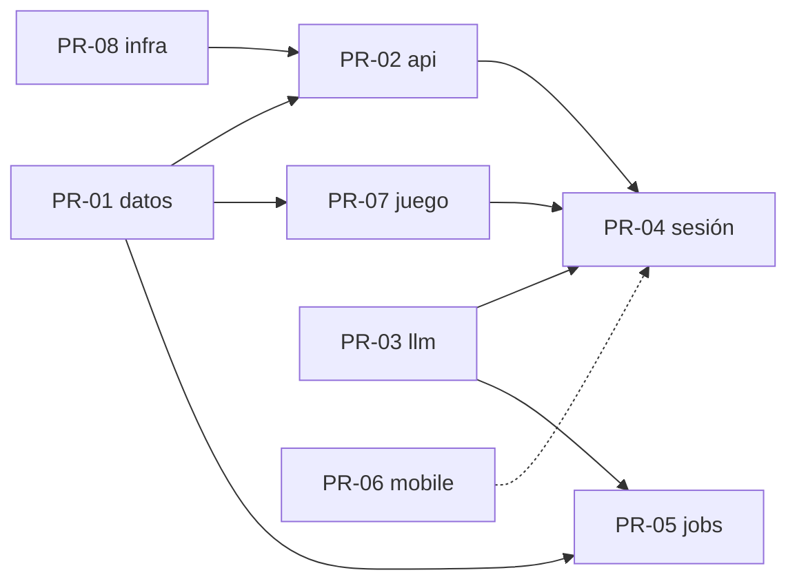

# Plan de tareas de Fluent

Regla de trabajo: **una spec = un PR = una sesión de Claude Code con subagentes. Una tarea = un commit.** Las sesiones corren en paralelo; los bloqueos son las dependencias listadas en cada tarea y solo esas.

## Ramas y PRs

| PR | Rama | Spec | Sesión líder | Puede empezar |
|---|---|---|---|---|
| [PR-08](PR-08-infraestructura.md) | `feat/infra` | SPEC-08 | Sonnet 5 | ya |
| [PR-01](PR-01-modelo-de-datos.md) | `feat/datos` | SPEC-01 | Opus 5 | ya |
| [PR-03](PR-03-llm.md) | `feat/llm` | SPEC-03 | Opus 5 | ya |
| [PR-06](PR-06-app-movil.md) | `feat/mobile` | SPEC-06 | Sonnet 5 | ya (pantallas contra API simulada) |
| [PR-02](PR-02-auth-y-api.md) | `feat/api` | SPEC-02 | Opus 5 | tras PR-08 T1 y PR-01 T1 fusionados |
| [PR-07](PR-07-gamificacion-y-social.md) | `feat/juego` | SPEC-07 | Sonnet 5 | tras PR-01 fusionado |
| [PR-04](PR-04-sesion.md) | `feat/sesion` | SPEC-04 | Opus 5 | tras PR-02 T1-T3 y PR-03 fusionados |
| [PR-05](PR-05-jobs.md) | `feat/jobs` | SPEC-05 | Sonnet 5 | tras PR-01 y PR-03 fusionados |

Orden de fusión previsto: 08 → 01 → 03 → 02 → 07 → 05 → 04 → 06. La app móvil se fusiona al final porque es la única que puede probarse de punta a punta solo cuando existe todo lo demás.

## Asignación de modelos

| Modelo | Cuándo | Ejemplos |
|---|---|---|
| **Opus 5** (`claude-opus-5`) | Diseño con margen de interpretación, seguridad, SQL con invariantes, prompts, concurrencia | funciones RPC, adaptador LLM, guard de auth, flujo de sesión, PKCE |
| **Sonnet 5** (`claude-sonnet-5`) | Implementación bien especificada, CRUD, pantallas, jobs, tests | endpoints con DTO, pantallas Flutter, jobs de BullMQ, Dockerfile |
| **Haiku 4.5** (`claude-haiku-4-5-20251001`) | Trabajo mecánico y repetitivo con criterio de aceptación exacto | `.env.example`, JSON de contenido, mapeos DTO ↔ fila, README |

La sesión líder de cada PR usa el modelo de la tabla anterior y delega cada tarea a un subagente con el modelo indicado en la tarea. La sesión líder revisa el diff de cada subagente antes de commitear.

## Contrato de cada tarea

- **ID** `PR-xx/Tn`. **Modelo.** **Depende de** (tareas o PRs fusionados). **Bloquea a**.
- **Alcance** con archivos a crear o tocar.
- **Criterio de aceptación** verificable con un comando.
- **Commit** con el mensaje exacto, formato Conventional Commits en español.

## Reglas para todas las sesiones

1. Leer `CLAUDE.md`, el PRD, la spec del PR y este archivo antes de tocar código.
2. No inventar: si la spec no lo dice, se anota en `docs/specs/PENDIENTES.md` y se elige lo más simple.
3. Cada commit compila y pasa tests: `pnpm --filter @fluent/api build && pnpm --filter @fluent/api test`, o `flutter analyze && flutter test` en `apps/mobile`.
4. Sin servidores de desarrollo en el VPS (ver `CLAUDE.md` global). Los tests e2e de la API usan `supertest` en memoria contra InsForge de pruebas (rama de InsForge del PR).
5. Cada PR abre una rama de InsForge con su nombre si toca la base de datos, y la fusiona al aprobar el PR.
6. Los contratos compartidos entre PRs son las specs. Si un PR necesita cambiar un contrato, edita la spec en su PR y avisa en la descripción.
7. Nada de secretos en el repo. Nada de `node_modules` fuera de `apps/api`.
8. Al terminar la sesión: PR con descripción que enlace la spec, lista de tareas hechas y pendientes, y captura o log del criterio de aceptación.

## Diseño

Las pantallas siguen el diseño de Pen del operador en `docs/design/`. Las sesiones de PR-06 lo leen antes de cada pantalla. Si falta una pantalla en el diseño, se sigue SPEC-06 §4 y se marca en el PR.
